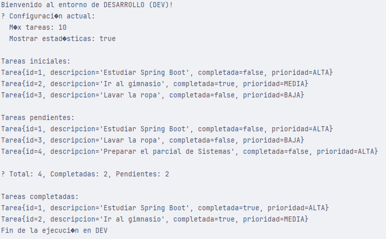
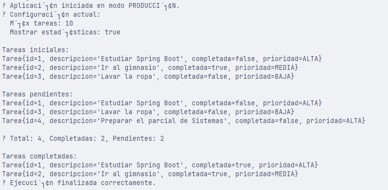

Aplicar los conceptos fundamentales de Spring Boot para construir una aplicación profesional que utilice:
- Inyección de dependencias  
- Estereotipos (`@Service`, `@Repository`)  
- Configuración mediante `application.properties`  
- Gestión de diferentes entornos mediante *profiles* (`dev` y `prod`)  

Tecnologías utilizadas
- **Java 21**
- **Spring Boot 3.x**
- **Maven**
- **IntelliJ IDEA**
- **Lombok** (opcional)
- **DevTools** para recarga rápida

Capturas de consola

Modo DEV

Modo PROD

